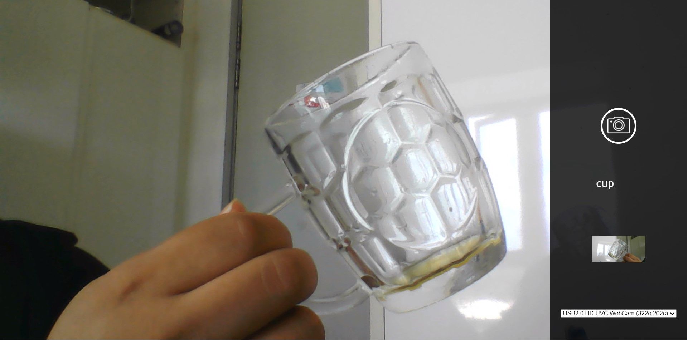

# Smart Bin

## Introduction

you can use your mobile phone or PC to take a photo of the item to be thrown to the bins, then the photo will send to the backend and it will return the class of the item to the frontend.

### from PC

### from mobile

## Install

### Add Models

go to the [google driver](https://drive.google.com/drive/folders/1J2g8viWP9A3dokd7MuZAFtRqJ1JCA67y?usp=sharing) to install the models and move it to the file path `scanner/backend/`

### Backend

`$ cd backend`
`$ pip install -r requirements.txt`
`$ python app.py` (change the host based on your address)

### Frontend

`$ cd frontend`
`$ npm install`
**Windows (Powershell)**
`$ ($env:HTTPS = "true") -and (npm start)`
**Windows (cmd.exe)**
`$ set HTTPS=true&&npm start`
**Linux, macOS (Bash)**
`$ HTTPS=true npm start`

## Detailed description

This project ensembled some neural networks to recognize the object, which based on the pretrained model EfficientNetV2B0, EfficientNetC2B1, EfficientNetV2B2 and ResNet152V2. If you want to know more details and construction of these neural networks, you can refer to these paper:[Deep Residual Learning for Image Recognition](https://arxiv.org/abs/1512.03385) , [Rethinking Model Scaling for Convolutional Neural Networks](https://arxiv.org/abs/1905.11946)

This project use the conception of [WNA](https://ionic.io/resources/articles/what-is-web-native#:~:text=Web%20Native%20apps%20are%20built,each%20platform%20they%20run%20on.)(Web Native App), which is an approach to cross-platform mobile application development that uses web technologies to create native mobile applications for iOS and Android, as well as mobile-optimized Progressive Web Apps.
